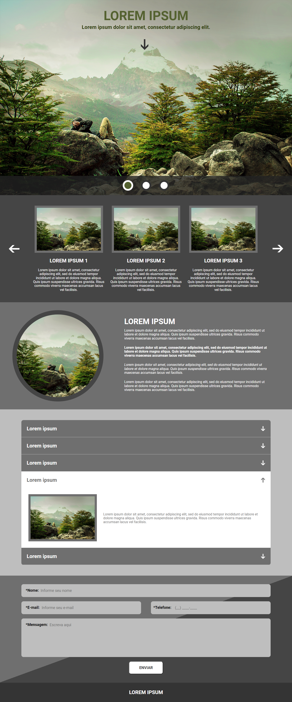
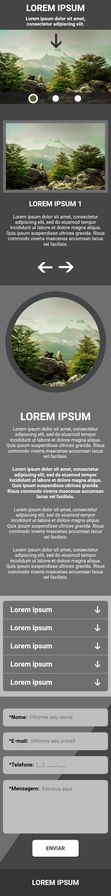
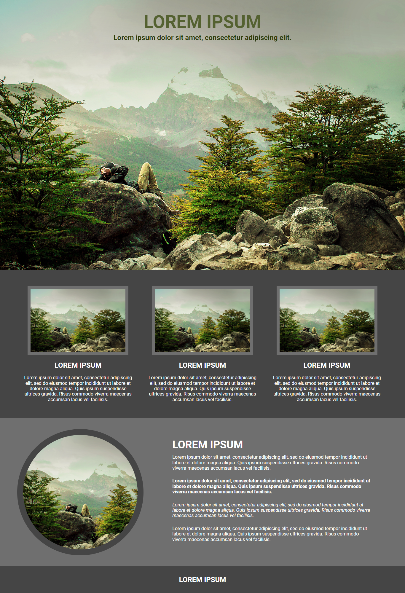
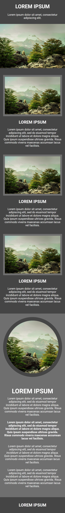

<h1 align="center">
  
   
  Teste DOT Group | Pleno | Júnior
</h1>

  <a href="https://teste-dot-pleno.vercel.app">Demonstração Teste para Pleno</a>
  |
  <a href="https://teste-dot-leohpc.vercel.app">Demonstração Teste para Júnior</a>

<h4 align="center">
  Este repositório é destinado a um teste que fiz para empresa "DOT Group", do qual consistia em recriar o design de uma aplicação pré estabelecida utilizando apenas HTML, CSS, JavaScript e Gulp. A aplicação deveria, também, ser responsiva, isso é, ser funcional em qualquer tamanho de tela. Neste repositório, estão os diretórios para as vagas de júnior e pleno.
</h4>

 <a href="#newspaper-layout">Layout</a> | <a href="#computer-pleno">Pleno</a> | <a href="#computer-júnior">Júnior</a> | <a href="#rocket-tecnologias">Tecnologias</a> | <a href="#yum-demonstração">Demonstração</a>

## :newspaper: Layout

O layout desejado pode ser conferido nos links abaixo:
- <a href="https://raw.githubusercontent.com/LeoHPC/teste-dot/main/ProvaFrontEndPleno-Desk.png?token=GHSAT0AAAAAABQOFMHWJ3S77Q5V4EYHVN66YWASIBQ">Desktop (pleno)</a>
- <a href="https://raw.githubusercontent.com/LeoHPC/teste-dot/main/ProvaFrontEndPleno-Mobile.png?token=GHSAT0AAAAAABQOFMHXDEISRTWFC52LM6PUYWASIJA">Mobile (pleno)</a>
- <a href="https://raw.githubusercontent.com/LeoHPC/teste-dot/main/ProvaFrontEndJunior-Desk.png?token=GHSAT0AAAAAABQOFMHWXFYD56PLA25QXTAEYWASHZQ">Desktop (júnior)</a>
- <a href="https://raw.githubusercontent.com/LeoHPC/teste-dot/main/ProvaFrontEndJunior-Mobile%20(1).png?token=GHSAT0AAAAAABQOFMHXMHOBFNWT5SINPFEGYWASHRA">Mobile (júnior)</a>

## :computer: Pleno

<h4 align="center">
  Versão de desktop | Versão mobile
</h4>

  
  

  
## :computer: Júnior

<h4 align="center">
  Versão de desktop | Versão mobile
</h4>

  
  

## :rocket: Tecnologias

Este projeto foi criado com as seguintes tecnologias:

  

    
    
    
                            
  

## :yum: Demonstração

Projeto já finalizado! Clique neste <a href="https://teste-dot-pleno.vercel.app">link</a> para testar o teste para pleno e <a href="https://teste-dot-leohpc.vercel.app">este</a> para o júnior! Ou então, clone este repositório em sua máquina, acesse a pasta do teste desejado e abra o arquivo "index.html" em seu navegador de preferência!

---

Feito com ❤ por Leonardo Henrique :kissing: [Contato](https://www.linkedin.com/in/leonardo-henrique-33a3ab210)
